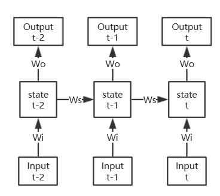
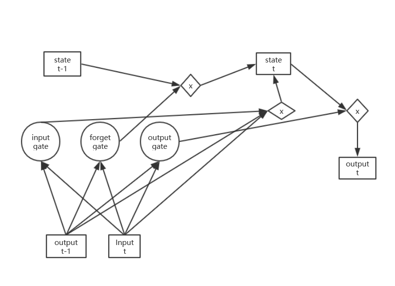

## 基本思想

从物理学的角度理解，对于某个系统，其下一时刻的状态是由上一时刻的状态唯一决定的。假设当前时刻的状态是$$s_t$$ ，那么下一时刻的状态就有$$s_{t+1} = f(s_t)$$ 。当然，这个系统也会受到外界的干扰，因此下一时刻的状态和这个时刻的输入$$i_t$$有关，于是有$$s_{t+1} = g(f_s(s_t) + f_i(i_t))$$ 。

一个直观的例子，假设有细胞正在进行繁殖，每一个时间单位细胞的数量都会翻倍，但是由于细胞团和外界接触的地方有损耗，会导致边界处一部分细胞死亡。假设时刻 $$t$$ 细胞的数量为 $$c_t$$ ，由于细胞在平面上繁殖，边界上的细胞数目就是 $$k\sqrt{c_t}$$  ，那么死亡的数目也是 $$k\sqrt{c_t}$$ （这两个$$k$$不相同，但都是一个常数）。那么就可以得到下一时刻细胞的个数 $$c_{t+1} = 2 * c_t - k\sqrt t$$

我所理解的循环神经网络也正是这个意思。

## 简单的循环神经网络结构



这是个最简单的RNN，很容易看出，他的实现方式和我们上面所叙述的基本一样，除了输出是关于state的函数。

其公式为

$$ h_t = \sigma_t(W_ix_t + W_hh_t + b_h)$$

$$y_t = \sigma_y (W_yh_t+b_y)$$

state 是个N维的向量。

理论上循环神经网络的长度是无限的，但是无限长的循环神经网络的训练，如果利用Backpropagation 就需要无限步，因此一般都是展开成有限步，然后第一步把 state 初始化为全0的向量。[参考tensorflow文档](https://www.tensorflow.org/tutorials/sequences/recurrent#truncated_backpropagation)。

## Tensorflow实现

```python
    # 输入的数据为 n_steps x n_batch_size x input_size
    rnn_raw_input = tf.placeholder(tf.float32, [n_steps, None, input_size])
    # 把输入的数据拆分成 n_steps 项，变成 n_steps 个tensor，然后feed 给n_steps 步的输入
    rnn_inputs = tf.unstack(rnn_raw_input)
	
    labels = tf.placeholder(tf.float32, [None, output_size])
    init_state = tf.zeros([1, state_size])

    with tf.variable_scope("rnn_cell"):
        weight_input = tf.get_variable("rnn_wi", [input_size, state_size])
        weight_prior = tf.get_variable("rnn_wp", [state_size, state_size])
        bias = tf.get_variable("rnn_bias", [state_size], initializer=tf.constant_initializer(0.0))

    def rnn_cell(cell_input, state):
        with tf.variable_scope("rnn_cell", reuse=True):
            wi = tf.get_variable("rnn_wi")
            wp = tf.get_variable("rnn_wp")
            b = tf.get_variable("rnn_bias")
        return tf.tanh(tf.matmul(state, wp) + tf.matmul(cell_input, wi) + b)

    # 利用前n_steps个状态作为输入预测当前的output
    rnn_states = []
    state = init_state
    for rnn_input in rnn_inputs:
        # 状态迁移
        state = rnn_cell(rnn_input, state)
        rnn_states.append(state)
    # 最终的状态，再进行一次全连接后输出
    final_state = rnn_states[-1]

    with tf.variable_scope("output_layer"):
        weight_output = tf.get_variable("w_o", [state_size, output_size])
        bias_output = tf.get_variable("b_o", [output_size], initializer=tf.constant_initializer(0.0))
        prediction = tf.nn.tanh(tf.matmul(final_state, weight_output + bias_output))

    loss = tf.reduce_mean(tf.square(prediction - labels))
    # 利用当前的输出计算损失函数并 backpropagation
    train_step = tf.train.AdagradOptimizer(0.1).minimize(loss)
```

注意在这个实现中，输入数据的格式为 n_steps x n_batch_size x input_size，一般的数据要利用numpy.swapaxes等操作才能传入。

## Long Short Term Memory

由于上述的简单的RNN在进行梯度下降求导的时候，如果网络长度过长，就会出现梯度下降或梯度消失的问题，因为

$$ \dfrac{\partial Loss}{\partial s_{t,i}} =\dfrac{\partial Loss}{\partial s_{t+1,j}} \dfrac{\partial s_{t+1,j}}{\partial s_{t,i}}$$

其中又有

$$\dfrac{\partial s_{t+1,j}}{\partial s_{t,i}} = \dfrac{\mathrm{d} \sigma_s  (i_{t+1, j})}{\mathrm{d} i_{t+1, j}} \cdot \dfrac{\partial i_{t+1, j}}{\partial s_{t,i}}$$

而显然又有

$$\dfrac{\partial i_{t+1, j}}{ \mathrm d s_{t, i}} = w_{i,j}​$$

因此，如果$$|w_{i,j}|>1​$$ , 导数就很容易在反向传播中出现发散情况，反之则会出现趋于0的情况，即梯度消失。

LSTM对此进行了一些改进，添加了input gate, output gate和forget gate，使得网络能够自动学习“应该记忆新学习的内容，应该遗忘多少上一时刻的状态”，因此可以避免上述的问题。

LSTM的大致结构如图：



LSTM的方程为


其中 $$f_t, i_t. o_t$$ 分别是 forget gate, input gate 和 output gate。$$\circ $$ 表示 element-wise multiply。参考[维基百科](https://en.wikipedia.org/wiki/Long_short-term_memory)

##Transformer

